# 🎨 DeepFake Detector UI

<div align="center">


**A modern, sleek React frontend for detecting manipulated images using AI**

[Features](#-features) • [Quick Start](#-quick-start) • [Screenshots](#-screenshots) • [Docker](#-docker-deployment) • [Tech Stack](#-tech-stack)

</div>

---

## ✨ Features

- 🖼️ **Drag & Drop Upload** - Intuitive image upload with drag-and-drop support
- 🎯 **Real-time Preview** - Instant preview of selected images with file metadata
- 🔍 **AI-Powered Analysis** - Connects to the backend for DeepFake detection
- 📊 **Visual Results** - Beautiful confidence meters and probability displays
- 🌙 **Dark Theme** - Modern glassmorphism dark design
- 📱 **Responsive Design** - Works seamlessly on desktop and mobile
- ⚡ **Lightning Fast** - Built with Vite for optimal performance
- 🐳 **Docker Ready** - Multi-stage Docker build with Nginx

---

## 🛠 Tech Stack

| Technology | Version     | Purpose                 |
| ---------- | ----------- | ----------------------- |
| **React**  | 19.2.0      | Frontend UI framework   |
| **Vite**   | 7.2.4       | Build tool & dev server |
| **ESLint** | 9.39.1      | Code linting            |
| **Nginx**  | Alpine      | Production server       |
| **Docker** | Multi-stage | Containerization        |

---

## 🚀 Quick Start

### Prerequisites

- Node.js 20+
- npm or yarn
- Backend API running (see [backend README](../backend/README.md))

### Installation

1. **Clone the repository**
   ```bash
   git clone <repository-url>
   cd frontend
   ```

2. **Install dependencies**
   ```bash
   npm install
   ```

3. **Configure API URL** (optional)
   
   Create a `.env` file or set the environment variable:
   ```bash
   VITE_API_URL=http://localhost:8002
   ```

4. **Start development server**
   ```bash
   npm run dev
   ```

5. **Open in browser**
   
   Navigate to [http://localhost:5173](http://localhost:5173)

---

## 📸 Screenshots

### Main Interface
The elegant dark-themed interface with drag-and-drop upload zone:

```
┌──────────────────────────────────────────────────────┐
│  🔍 Image Detector                     ● AI Powered  │
├──────────────────────────────────────────────────────┤
│                                                      │
│            Detect Image Manipulations                │
│   Leverage advanced AI and Error Level Analysis      │
│                                                      │
│    ┌────────────────────────────────────────┐       │
│    │          📤                            │       │
│    │    Drop your image here                │       │
│    │    or click to browse                  │       │
│    │                                        │       │
│    │    [JPG] [PNG] [JPEG] [WEBP]          │       │
│    └────────────────────────────────────────┘       │
│                                                      │
└──────────────────────────────────────────────────────┘
```

### Analysis Results
Visual display of detection results with confidence scores:

```
┌──────────────────────────────────────────────────────┐
│  ✓ Authentic Image                                   │
│  This image appears to be genuine and unmanipulated  │
├──────────────────────────────────────────────────────┤
│  Confidence Level                        95.67%      │
│  ████████████████████████████░░░░                   │
│                                                      │
│  Real Probability    │    Fake Probability          │
│       95.67%         │         4.33%                │
└──────────────────────────────────────────────────────┘
```

---

## 🎯 User Flow

```mermaid
graph LR
    A[Open App] --> B[Upload Image]
    B --> C[Preview Image]
    C --> D[Click Verify]
    D --> E[AI Analysis]
    E --> F[View Results]
    F --> G{Authentic?}
    G -->|Yes| H[✓ Real Image]
    G -->|No| I[⚠ Fake Detected]
```



### Step-by-Step Process

1. **Upload Image** - Drag & drop or click to select an image (JPG, PNG, JPEG, WEBP)
2. **AI Analysis** - The backend uses Error Level Analysis (ELA) to detect manipulations
3. **Get Results** - Receive instant feedback with confidence scores

---

## 📁 Project Structure

```
frontend/
├── public/              # Static assets
├── src/
│   ├── assets/          # Images and icons
│   ├── App.jsx          # Main application component
│   ├── App.css          # Component styles
│   ├── index.css        # Global styles
│   └── main.jsx         # React entry point
├── index.html           # HTML template
├── package.json         # Dependencies
├── vite.config.js       # Vite configuration
├── eslint.config.js     # ESLint configuration
├── Dockerfile           # Docker multi-stage build
├── nginx.conf           # Nginx configuration
└── README.md            # This file
```

---

## 🐳 Docker Deployment

### Using Docker Compose (Recommended)

From the project root directory:

```bash
docker-compose up --build
```

The UI will be available at `http://localhost:3000`

### Using Docker Standalone

1. **Build the image**
   ```bash
   docker build -t deepfake-ui \
     --build-arg VITE_API_URL=http://your-api:8000 .
   ```

2. **Run the container**
   ```bash
   docker run -d \
     -p 3000:80 \
     --name deepfake-ui \
     deepfake-ui
   ```

### Build Arguments

| Argument       | Description     | Default                 |
| -------------- | --------------- | ----------------------- |
| `VITE_API_URL` | Backend API URL | `http://localhost:8000` |

---

## ⚙️ Available Scripts

| Command           | Description              |
| ----------------- | ------------------------ |
| `npm run dev`     | Start development server |
| `npm run build`   | Build for production     |
| `npm run preview` | Preview production build |
| `npm run lint`    | Run ESLint               |

---

## 🔌 API Integration

The frontend connects to the backend API for image analysis:

### Configuration

Set the API URL via environment variable:

```bash
# Development (.env file)
VITE_API_URL=http://localhost:8002

# Docker (build arg)
docker build --build-arg VITE_API_URL=/api .
```

### API Endpoint Used

```javascript
POST /upload
Content-Type: multipart/form-data
Body: { file: <image_file> }

Response: {
  "file": "image.jpg",
  "prediction": "Real" | "Fake",
  "confidence": 95.67,
  "probabilities": {
    "real": 95.67,
    "fake": 4.33
  }
}
```

---

## 🎨 Design System

### Color Palette

| Color      | Hex       | Usage                       |
| ---------- | --------- | --------------------------- |
| Background | `#0a0a0f` | Main app background         |
| Card       | `#1a1a2e` | Card backgrounds            |
| Accent     | `#6366f1` | Primary buttons, highlights |
| Success    | `#10b981` | Real/authentic results      |
| Danger     | `#ef4444` | Fake/manipulated results    |
| Text       | `#e5e7eb` | Primary text                |

### Components

- **Glassmorphism Cards** - Frosted glass effect with blur
- **Gradient Buttons** - Animated gradient backgrounds
- **Progress Bars** - Visual confidence indicators
- **Animations** - Smooth micro-interactions

---

## 🔧 Development

### Prerequisites

- Node.js 20+
- npm 10+

### Code Style

The project uses ESLint with React-specific rules:

```bash
# Check for linting errors
npm run lint
```

### Hot Reload

Vite provides instant hot module replacement during development:

```bash
npm run dev
```

---

## 📋 Browser Support

| Browser | Support  |
| ------- | -------- |
| Chrome  | ✅ Latest |
| Firefox | ✅ Latest |
| Safari  | ✅ Latest |
| Edge    | ✅ Latest |

---

## 🤝 Contributing

Contributions are welcome! Please feel free to submit a Pull Request.

---

## 📝 License

This project is part of an academic deep learning course at TEKUP.

---

<div align="center">

**Made with ❤️ using React & Vite**

[⬆ Back to Top](#-deepfake-detector-ui)

</div>
